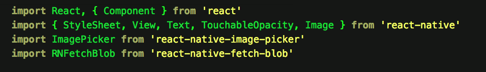
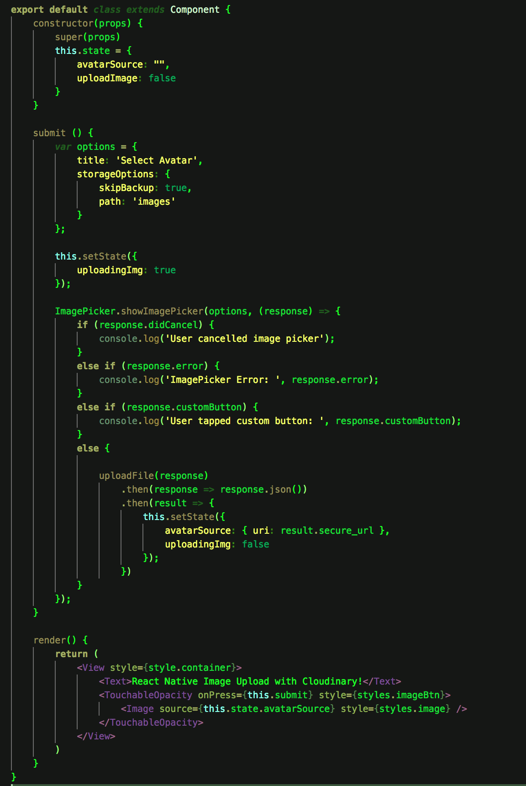
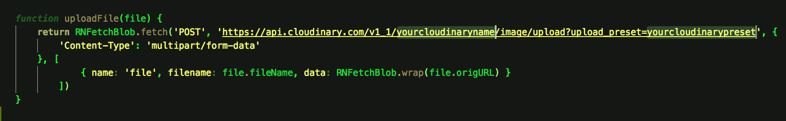
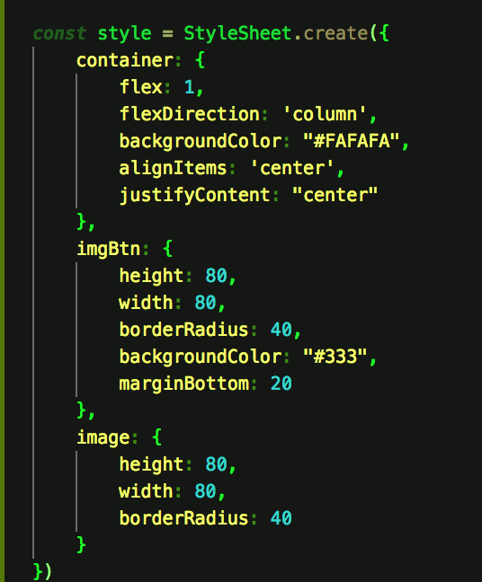

Greetings creatures of the world. Today, we're gonna upload images to Cloudinary using React Native! 😬

("Cloudinary is the image back-end for web and mobile developers. An end-to-end solution for all your image-related needs." - [The Cloudinary Website](https://cloudinary.com))

First you wanna make sure you have the React Native CLI installed (We're not using create-react-native-app). Then, you wanna signup up to [Cloudinary](https://cloudinary.com) if haven't already.

Now let's get down to business.🤓

## Step 1

`react-native init imageupload`

`cd imageupload`

`npm install`

Create the folder where we'll keep our main component (Which we'll render to Android and iOS):

`mkdir app`

Create the component file:

`touch app/index.js`

## Step 2

Replace `index.android.js` and `index.ios.js` with the following:

```
import React from 'react'
import { AppRegistry } from 'react-native'

import App from './app/index'

AppRegistry.registerComponent('imageupload', () => App)
```

## Step 3

Run `npm install —-save react-native-image-picker react-native-fetch-blob`

then `react-native link`.

That should successfully install and link the packages required for accessing the file system (included with react-native-image-picker) and posting the image data to Cloudinary (react-native-fetch-blob).

## Step 4

Before we can access files on the device, we have to ask the user for permission first. Follows these instructions to allow permissions for Android and iOS:

### iOS
Add this to `ios/app_name/Info.plist`:


### Android
Add this to `android/app/src/AndroidManifest.xml`:


## Step 5

This is the main component we use to do everything (`app/index.js`). 

Our imports: 


The component class: 


Replace the Cloudinary name and upload preset in the upload method with your Cloudinary name and upload_preset: 



To create an upload preset:

Login to Cloudinary

Click on the settings icon (Gear icon)

Click on the Upload tab

Scroll down to upload presets and click add upload preset. Use the upload preset name you just created.

The styles: 



## Step 6

Once that's all done and dusted, run `react-native run-ios` or `react-native run-andoid` and upload your images to Cloudinary!!

[The code exists on Github too](https://github.com/TarCode/react-native-cloudinary) 

# 👽 🤓 👾


